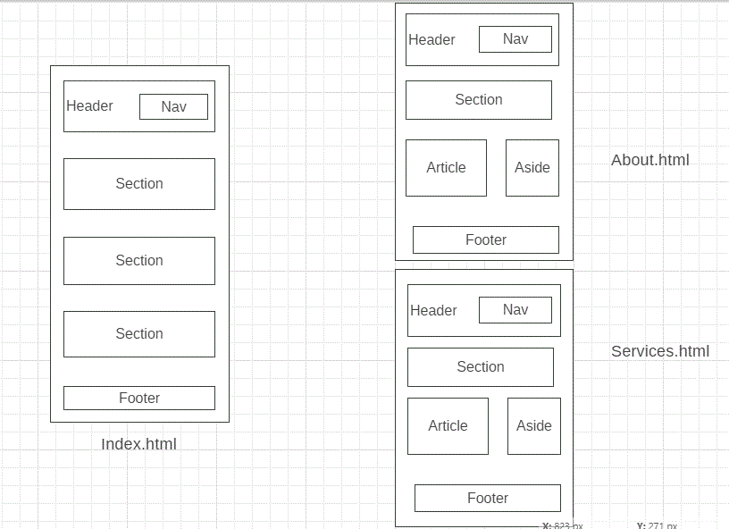

# Acme-web-example
This project is for every beginner who want to learn how to use branches and build a responsive layout web page.

# WireFrame

## 0. Set-Up

__A User can see my initial repository and live demo__

### Branch

1. Created a new repository generated from [this template](https://github.com/murvanessa/acme-web-example)
1. Clone the repository
1. Copy-paste the markdown from this file to the empty `development-strategy.md` file in the new repo
1. Add [this wireframe](./wireframe.gif) into your new repo
1. Start your README file
1. Push the changes
1. turn on GitHub Pages

## 1. User Story: header and footer

__As a site visitor, I want to know what the web page is called__

### Branches

1. This user story was developed on a branch called `Header-footer`
1. It was merged to `master` when the feature was finished.

### HTML

- A header element with a title describing the web page
- A pleasant footer

### CSS

- Layout styling for the header & footer
- Text styling for the main title

---

## 2. User Story: main page

__As a site visitor, I want to read an introduction to this web page__

### Branches

1. This user story was developed on a brach called `Main`
1. It was merged to `master` when the feature was finished.

### HTML

- section element
- some nice text in the section introducing users to this web page
- search bar

### CSS

Styling for the new element

---

## 3. User Story: relate page about

__As a site visitor, I want to read an introduction to this web page__

### Branches

1. This user story was developed on a brach called `About`
1. It was merged to `master` when the feature was finished.

### HTML

- section element
- some nice text in the section introducing users to this web page
- search bar

### CSS

Styling for the new element

---

## 4. User Story: relate page services

__As a site visitor, I want to read an introduction to this web page__

### Branches

1. This user story was developed on a brach called `Services`
1. It was merged to `master` when the feature was finished.

### HTML

- section element
- some nice text in the section introducing users to this web page
- search bar

### CSS

Styling for the new element

---

## 5. User Story: layout

__As a site visitor, I want to read an introduction to this web page__

### Branches

1. This user story was developed on a brach called `layout`
1. It was merged to `master` when the feature was finished.

### CSS

Here we only modified the css file so by adding @media to make the web page responsive
---